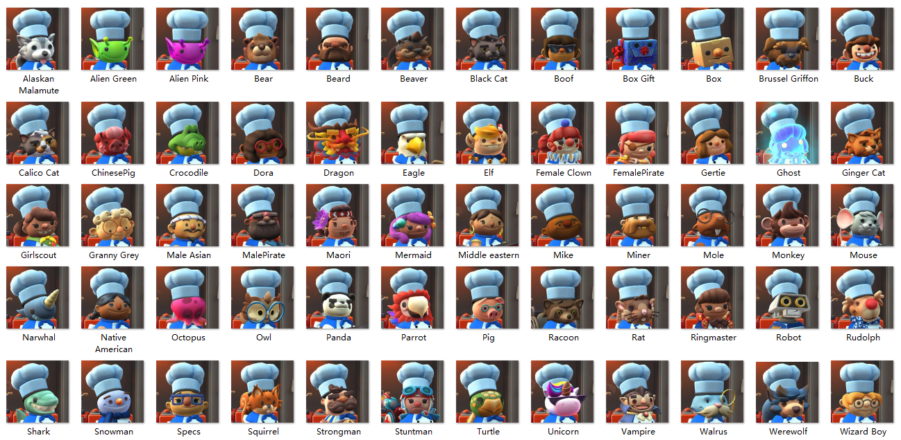
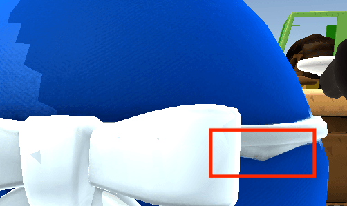

# 胡闹厨房2 - 厨师外观模组

## 安装

1. 安装 BepInEx 5：

   Steam 端安装 x86 版本（[GitHub](https://github.com/BepInEx/BepInEx/releases) 或 [百度网盘链接](https://pan.baidu.com/s/1G81rpJNwVsJplJi6fD2jPA?pwd=lobe)）

   Epic 端安装 x64 版本（[GitHub](https://github.com/BepInEx/BepInEx/releases) 或 [百度网盘链接](https://pan.baidu.com/s/1C4UDhK7R9Ei6Eu0B6lQ9Cw?pwd=3lu1)）

   解压后拷贝到游戏根目录下

   

       
   

   > 开启 `BepInEx` 的控制台可能会导致无法以手柄进入游戏。确保配置文件 `BepInEx/config/BepInEx.cfg` 中 `[Logging.Console]` 组中值为 `Enabled = false`。

2. 将 `OC2DIYChef` 文件夹拷贝到 `BepInEx/plugins` 文件夹中

## 使用

### 隐藏部分厨师

- 将 `OC2DIYChef/official-all.txt` 原地复制一份并重命名为 `prefer.txt`，然后编辑 `prefer.txt`，删去不想使用的厨师的名字。厨师名对应见下图。

  

      
  
 
  
由糯米糍整理

  
- 可以在 `prefer.txt` 中对厨师排序，其中第一个厨师是默认厨师。每次进入游戏或添加本地玩家时会自动选用默认厨师。联机时若你使用额外厨师，对于没有安装此 MOD 的其他玩家显示的是默认厨师。

- 此 MOD 不会修改厨师的解锁状态，包括需要通过关卡或 DLC 解锁的厨师。

- 其他玩家仍会正常显示其选择的厨师，即使你隐藏了该厨师。

### 添加额外厨师

- 将厨师资源文件夹拷贝到 `OC2DIYChef/Resources` 文件夹中，并将厨师资源文件夹名添加到 `prefer.txt` 中即可。
- 在资源文件夹中但未添加到 `prefer.txt` 的额外厨师不会被加载。
- 额外厨师不能作为默认厨师。
- 额外厨师的联机互相显示规则为：当主机安装了此 MOD 且两个玩家都添加了某一个额外厨师时，互相显示该额外厨师；否则选择额外厨师对其他玩家显示的是默认厨师。
- 部分三代厨师资源：[链接](https://pan.baidu.com/s/1EWneQ8k8-P0v49UKs5UpRg?pwd=iu9i)。

### 替换帽子

在 `prefer.txt` 的每个厨师后面可以（用空格隔开）添加 `HAT=xxx` 用来指定该厨师的帽子样式，可选的有 `None`（不戴）, `Santa`（圣诞）, `Fancy`（厨师帽）, `Baseballcap`（篝火）。

### 添加额外帽子

- 将帽子资源文件夹拷贝到 `OC2DIYChef/Resources/HATS` 文件夹中即可，帽子名为帽子资源文件夹名。

### 街机大厅换厨师

在 `prefer.txt` 添加一行 `LOBBYSWITCHCHEF=TRUE` 即可在街机大厅按上下键换厨师。

### 提示消息

- 默认厨师不可用：`prefer.txt` 第一行的厨师必须是已解锁的非额外厨师，否则将设置 Male_Asian 为默认厨师。
- 缺失 INFO 文件：每个额外厨师资源文件夹中必须包含名为 `INFO` 的信息文件。
- 缺失主贴图：每个额外厨师资源文件夹中必须包含名为 `t_Head.png` 的主贴图文件和名为 `m_Head.txt` 的主材质文件。
- ID 冲突：两个额外厨师的 ID 冲突，或 `INFO` 文件中缺少 ID 值定义。

## 自制厨师指南

- 你可以自制厨师外观。每个自制厨师包括其模型、贴图和材质。

- 参考示例资源格式，你至少需要提供：

  - 头部模型 `Head.obj`，主贴图 `t_Head.png` 以及主材质 `m_Head.txt`；
  - 手部张开和抓握模型 `Hand_{Grip/Open}_{L/R}.obj`；
  - `INFO` 文件，其中包含值 `ID=xxx`。额外厨师的 ID 是一个 0 ~ 254 的整数，用作联机消息传递。ID 值 0 ~ 63 预留给三代厨师资源，请选择从 64 开始的值，且最好避开已发布的额外厨师的 ID 值。

  此外还可以提供：

  - 尾巴模型 `Tail.obj`；

  - 固定在头部的部件模型 `Head{1/2}.obj`；

  - 眼部模型 `Eyes.obj`（睁眼），`Eyes2_Blinks.obj`（闭眼），`Eyebrows.obj`（眉毛）；

  - 身体各部分模型 `Body_Body.obj`, `Body_Top.obj`, `Body_NeckTie.obj`, `Body_Tail.obj`, `Body_Bottom.obj`，以及身体贴图和材质 `t_Body.png`, `m_Body.txt`；

    > - Body_Body 会根据顶点高度按不同权重绑定骨骼，动画效果类似弹簧；其余身体部分绑定单个骨骼。
    > - 身体贴图中全透明的部分会替换为厨师颜色（蓝 / 红 / 绿 / 黄）。
    > - 当且仅当提供 Body_Body 时会删除原本的身体。有需要时你可以提供一个空的 Body_Body。
    > - Tail 在厨师背上背包时会隐藏，Body_Tail 不会。
    > - 所有 Body_xxx 在厨师进入大炮时会隐藏。

  - 载具模型 `Wheelchair.obj`；

  - 刀模型 `Knife.obj`；

  - 各模型的单独贴图 / 材质文件（文件名前缀 `t_` / `m_`，无单独贴图 / 材质的模型使用主贴图 / 材质）；

    > - 例如 Body_Top 会依次尝试寻找贴图文件 t_Body_Top，t_Body，t_Head。
    >
    > - 材质参数说明：
    >
    >   `_Brightness_Intensity`：身体部分可用，总光照强度；
    >   `_Metallic`：金属度；
    >   `_RimIntensity`：边缘光强度；
    >   `_RimPower`：边缘光衰减；
    >   `_Roughness`：平滑度，值越大代表越平滑。

  - `INFO` 文件中可以添加 `BODY=xxx` 来使用不同的身体模型，例如 `BODY=Chef_Snowman`。

- 你可以自制帽子。需要提供帽子模型、贴图和材质 `HatName.obj`, `t_HatName.png`, `m_HatName.txt`，放在文件夹 `HatName` 中。不要使用以下帽子名：`None, Santa, Festive, Baseballcap, Baseball, Fancy`。

  

## 更新

#### v1.2

- 支持替换刀模型。

#### v1.1

- 支持自制厨师身体等更多部分。

- 支持自制帽子，支持在 UI 界面使用各种帽子。

- 增加模型加载进度显示。

- 修复了厨师被车撞后的淡出效果。

- 修复了原始厨师模型上的一个顶点权重错误。

  

      
  

- 兼容配置文件名 `prefer.txt.txt`。