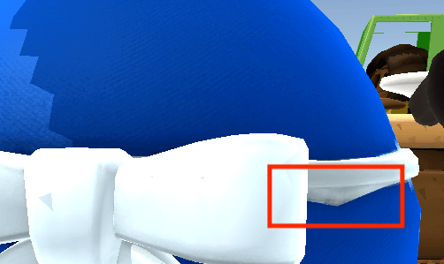

# Overcooked! 2 - DIY Chef MOD

## Installation

1. Install [BepInEx 5](https://github.com/BepInEx/BepInEx/releases) for the game (x86 for Steam, x64 for Epic)
2. Create a new folder `BepInEx/plugins/OC2DIYChef` in the game's directory and copy `bin/Release/OC2DIYChef.dll` to it

> ### Compiling
>
> You may compile the MOD yourself. The following dependencies need to be copied into `lib/` directory: 
>
> - In the game's `Overcooked2_Data/Managed/` directory `Assembly-CSharp.dll`, `UnityEngine.dll`, `UnityEngine.CoreModule.dll`, `UnityEngine.UI.dll`, `UnityEngine.IMGUIModule.dll`, `UnityEngine.ImageConversionModule.dll`, `UnityEngine.TextRenderingModule.dll`.
> - In `BepInEx/core/` directory `0Harmony20.dll`, `BepInEx.dll`, `BepInEx.Harmony.dll`.

## How to use

### Hiding some of the chefs

- Copy and rename `official-all.txt` as `OC2DIYChef/prefer.txt`, then edit it and remove the names of the chefs you don't want to use. The names of all the chefs are shown below.

  

      
  
 
  
- You can sort the chefs in `prefer.txt`. 

  The first chef is the default chef. The default chef is automatically chosen every time when you enter the game or add a local player. If you use a DIY chef when playing online, the default chef will be shown to other players who do not have this mod installed.

- This mod does not change the unlocked status of chefs, including chefs that need to be unlocked by beating levels or purchasing DLCs.

- Other players' (non-DIY) chefs will still be shown normally, even if you have hidden it.

### Adding DIY chefs

- Copy the DIY Chef resource folder released by the modeler into the `OC2DIYChef/Resources` folder and add the DIY chef resource folder name to `prefer.txt`. 

- DIY chefs that are in the `OC2DIYChef/Resources` folder but not added to `prefer.txt` will not be loaded.

- DIY chefs cannot be used as the default chef.

- How DIY chefs are shown to other online players: 

  When the host has this mod installed and another player has added the same DIY chef, the DIY chef will be shown to the player. Otherwise, your default chef is shown to the player.

- Some of the AYCE chef resources are packed as `Resources_ayce1.zip`.

### Specifying hat styles

After each chef in `prefer.txt`, you can add `HAT=xxx` (separated by spaces) to specify the hat style for that chef. The options are `None`, `Santa`, `Fancy`, `Baseballcap`.

### Adding DIY hats

- Copy the DIY hat resource folder released by the modeler into the `OC2DIYChef/Resources/HATS` folder. Use the DIY hat resource folder name as the hat's name. 

### Switching chefs at the arcade lobby

Add a line `LOBBYSWITCHCHEF=TRUE` to `prefer.txt` to switch chefs at the lobby by pressing up / down.

### Warning messages

- Invalid default chef: the chef on the first line of `prefer.txt` must be an unlocked non-DIY chef, otherwise `Male_Asian` will be set as the default chef.
- Missing INFO file: each DIY chef resource folder must contain an info file named `INFO`.
- Missing main texture: each DIY chef resource folder must contain a main texture file named `t_Head.png` and a main material file named `m_Head.txt`.
- ID conflict: two DIY chefs have conflicting IDs, or the ID is missing in the `INFO` file.

## How to make a DIY chef

- You can make your own DIY chef. Each DIY chef includes its model, textures and materials.

- Refer to the example resource, you need to provide at least:

  - A head model `Head.obj`, main texture `t_Head.png` and main material `m_Head.txt`;
  - Hand open and grip models `Hand_{Grip/Open}_{L/R}.obj`;
  - An `INFO` file containing a value `ID=xxx`. The ID of a DIY chef is an integer from 0 to 254 which is used for online messaging. ID values 0 to 63 are reserved for AYCE chef resources. Please choose values starting from 64 and preferably avoid the ID values of already published DIY chefs.

  You may also provide:

  - A tail model `Tail.obj`;
  
  - Models of parts fixed to the head `Head{1/2}.obj`;
  
  - Models of eyes `Eyes.obj` (eyes open), `Eyes2_Blinks.obj` (eyes closed), `Eyebrows.obj` (eyebrows);
  
  - Models of body parts `Body_Body.obj`, `Body_Top.obj`, `Body_NeckTie.obj`, `Body_Tail.obj`, `Body_Bottom.obj`, as well as body texture and material `t_Body.png`, `m_Body.txt`;
  
    > - `Body_Body` will bind bones with different weights according to the vertex height, animating like a spring; other body parts will bind correspondingly to a single bone.
    > - Fully transparent parts of the body texture will be replaced with chef colors (blue / red / green / yellow).
    > - The original body is removed if and only if `Body_Body` is provided. You can add an empty `Body_Body` if needed.
    > - `Tail` will be hidden when the chef is carrying a backpack, `Body_Tail` will not.
    > - All `Body_xxx` will be hidden when the chef enters a cannon.
  
  - A vehicle model `Wheelchair.obj`;
  
  - Individual texture / material files for each model (with prefix `t_` / `m_`, models without individual textures use the main texture / material);
  
    > For example, `Body_Top` tries to find texture files `t_Body_Top`, `t_Body`, `t_Head` sequentially.
  
  - You can add `BODY=xxx` to the `INFO` file to use a different body model, e.g. `BODY=Chef_Snowman`.
  
- You can make your own DIY hat. You need to provide the hat model, textures and materials `HatName.obj`, `t_HatName.png`, `m_HatName.txt` in a folder `HatName`. Do not use the following hat names: `None`, `Santa`, `Festive`, `Baseballcap`, `Baseball`, `Fancy`.

  

## Update Log

#### v1.1

- Support DIY chef body and many more parts.

- Support DIY hats, support showing various hats in the lobby.

- Add model loading progress display.

- Fix the fading effect when the chef is hit by a car.

- Fix a vertex weight error in the original chef model.

  

      
  

- Compatible with config file name `prefer.txt.txt`.

